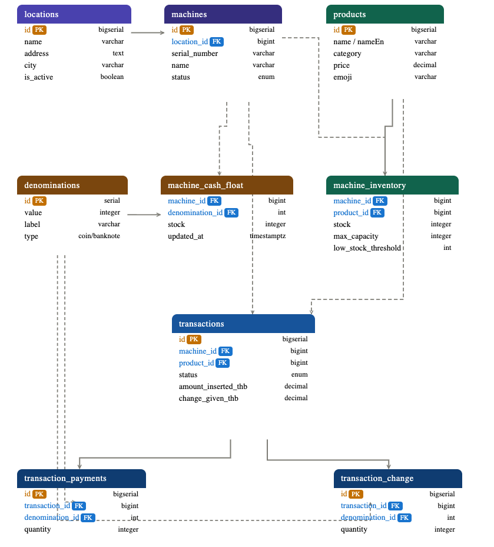

# Vending Machine

A full-stack vending machine simulation — Next.js frontend + Express REST API + PostgreSQL.

---

## Live demo

Try the UI at **[vending-machine-virid.vercel.app](https://vending-machine-virid.vercel.app/)**

> Uses mock data — no backend or database needed.

---


## Repository structure

```
vending-machine/
├── frontend/     → Next.js (deployed to Vercel)
└── backend/      → Express + Knex + PostgreSQL
```

---

## Option 1 — Quick demo (no setup)

Visit **[vending-machine-virid.vercel.app](https://vending-machine-virid.vercel.app/)** and use the machine immediately.
All data is mocked in the browser — nothing to install.

---

## Option 2 — Full stack with real data (Docker)

Run frontend, backend, and PostgreSQL together in Docker.
Everything is pre-configured — migrations and seeds run automatically.

### Prerequisites

- [Docker Desktop](https://www.docker.com/products/docker-desktop/) installed and running

### Steps

**1. Clone the repo**

```bash
git clone https://github.com/your-username/vending-machine.git
cd vending-machine
```

**2. Start the backend + database**

Open a terminal and run:

```bash
cd backend && npm run dev:docker
```

This starts the Express API and PostgreSQL. Migrations and seed data run automatically on first boot.

**3. Start the frontend**

Open a second terminal and run:


```bash
cd frontend && npm run dev:docker
```


**4. Open the app**

| Service | URL |
|---|---|
| Frontend | http://localhost:3000 |
| Backend API | http://localhost:8080/api/v1 |
| Health check | http://localhost:8080/health |

The frontend now fetches real products, inventory, and cash float from PostgreSQL instead of mock data.


## Further reading

- [Frontend README](./frontend/README.md) — Next.js setup, env vars, Vercel deployment
- [Backend README](./backend/README.md) — API reference, DB schema, migrations, all scripts


## DB ERD Relation


